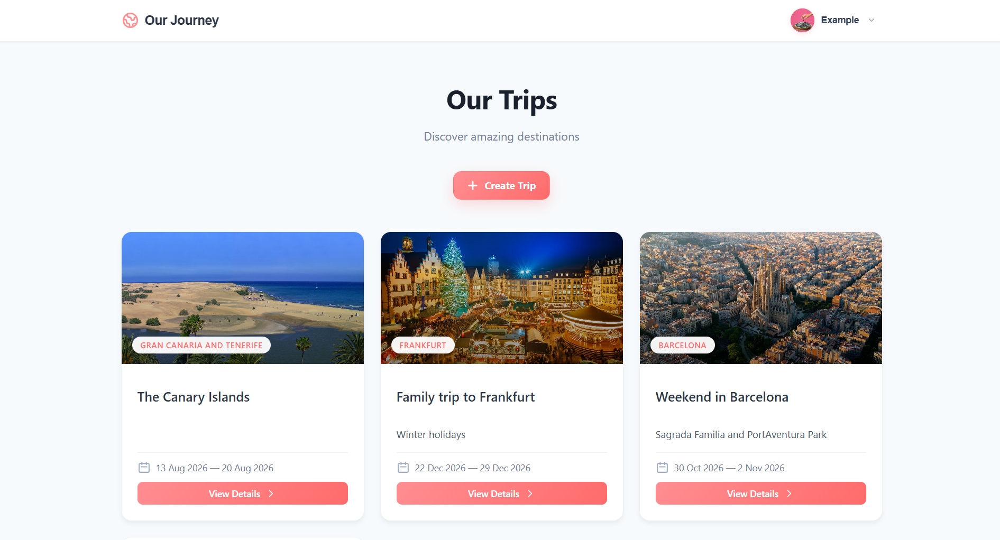
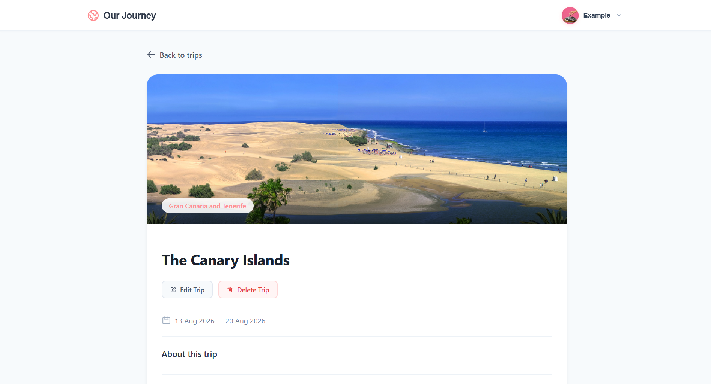
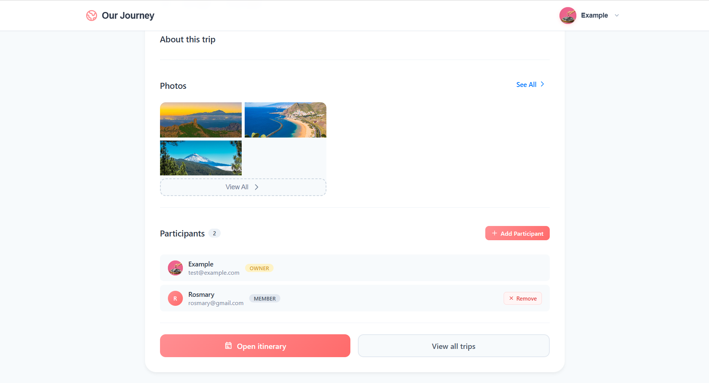
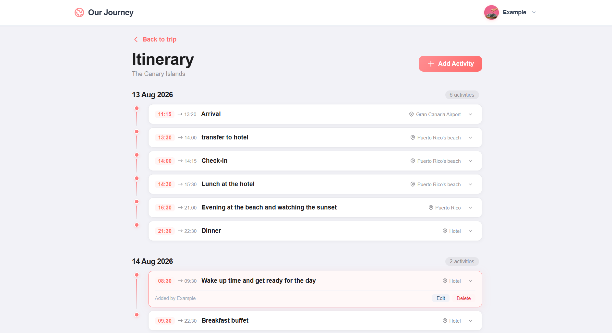
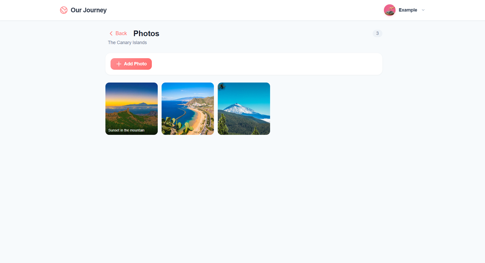
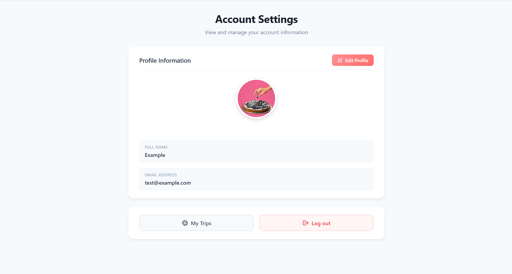
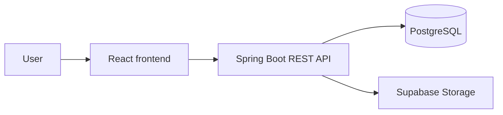

# Our Journey

[](https://github.com/rgarciapedroza/our-journey/actions/workflows/ci.yml)

Our Journey is a full-stack travel planning application that allows users to create trips, collaborate with other travellers, organize shared itineraries, and preserve memories through photo galleries.

## Live Demo

[Open Our Journey](https://our-journey-iota-pink.vercel.app)

> **Note:** The backend is hosted on a free-tier service and may take up to a minute to start after a period of inactivity. Please allow a few seconds for the first request to complete.

## Features

- Secure registration and login using JWT authentication
- Personal account and profile-picture management
- Trip creation, editing and deletion
- Private trip-cover upload, replacement and removal
- Collaborative trip membership
- User search by name and email
- Shared trip photo galleries with optional captions
- Private trip-photo storage using signed Supabase URLs
- Collaborative itinerary creation, editing and deletion
- Responsive frontend interface
- Automated backend tests and frontend builds with GitHub Actions

## Screenshots

| Trips dashboard | Trip overview |
|---|---|
|  |  |

| Trip collaboration | Shared itinerary |
|---|---|
|  |  |

| Photo gallery | Account settings |
|---|---|
|  |  |

## Technology Stack

### Frontend

- React 19
- TypeScript
- Vite
- React Router
- CSS Modules

### Backend

- Java 21
- Spring Boot
- Spring Security
- Spring Data JPA
- JWT authentication
- Maven

### Infrastructure

- PostgreSQL hosted on Supabase
- Supabase Storage
- Vercel frontend hosting
- Render backend hosting
- Docker and Docker Compose
- GitHub Actions

## Architecture

The application follows a client-server architecture. The React frontend communicates with a REST API provided by Spring Boot. The backend owns the authentication, authorization and business rules, persists application data in PostgreSQL, and manages media files through Supabase Storage.



The backend is organized into controllers, services, repositories, entities and DTOs to keep HTTP handling, business logic and persistence responsibilities separated.

### Production Deployment

The production frontend is deployed on Vercel and communicates over HTTPS with the Spring Boot API hosted on Render. PostgreSQL and media storage are managed through Supabase. Secrets and environment-specific URLs are supplied through the hosting platforms and are not embedded in the repository or frontend bundle.

## Getting Started

### Prerequisites

Install or create the following before starting:

- [Git](https://git-scm.com/)
- [Docker Desktop](https://www.docker.com/products/docker-desktop/)
- A [Supabase](https://supabase.com/) project

### 1. Clone the repository

```bash
git clone https://github.com/rgarciapedroza/our-journey.git
cd our-journey
```

### 2. Configure Supabase Storage

Create these buckets in the Supabase Storage dashboard:

| Bucket | Access | Purpose |
|---|---|---|
| `profile-pictures` | Public | User profile pictures |
| `trip-photos` | Private | Photos shared by trip members |
| `trip-covers` | Private | Trip cover images |

Trip photos and covers remain private and are accessed through temporary signed URLs generated by the backend. The Supabase server key must only be stored in the root `.env` file and must never be exposed to the frontend or committed to Git.

### 3. Create the environment file

Create a local `.env` file from the provided example.

On macOS, Linux or Git Bash:

```bash
cp .env.example .env
```

On Windows PowerShell:

```powershell
Copy-Item .env.example .env
```

Open `.env` and replace every placeholder with your local values. In particular:

- `POSTGRES_PASSWORD` and `SPRING_DATASOURCE_PASSWORD` must contain the same password.
- `JWT_SECRET` must be a cryptographically secure random value of at least 32 characters.
- `SUPABASE_URL` must contain the URL of your Supabase project.
- `SUPABASE_KEY` must contain a server-side Supabase key with access to the configured buckets.
- Never commit `.env`; it is already excluded by `.gitignore`.

You can generate a JWT secret with OpenSSL:

```bash
openssl rand -base64 32
```

### 4. Start the application

Make sure Docker Desktop is running, then execute this command from the repository root:

```bash
docker compose up --build
```

Docker Compose builds and starts PostgreSQL, the Spring Boot API and the React frontend. PostgreSQL is checked for readiness before the backend starts.

Once the services are ready, open:

- Frontend: [http://localhost:3000](http://localhost:3000)
- Backend API: [http://localhost:8080](http://localhost:8080)
- PostgreSQL: `localhost:5432`

To stop the application while preserving the database volume, press `Ctrl+C` and run:

```bash
docker compose down
```

## Environment Variables

| Variable | Description | Default |
|---|---|---|
| `POSTGRES_DB` | PostgreSQL database name | `our_journey` |
| `POSTGRES_USER` | PostgreSQL user | `postgres` |
| `POSTGRES_PASSWORD` | PostgreSQL password | None |
| `SPRING_DATASOURCE_URL` | JDBC connection URL used by Spring Boot | Docker database URL |
| `SPRING_DATASOURCE_USERNAME` | Database user used by Spring Boot | `postgres` |
| `SPRING_DATASOURCE_PASSWORD` | Database password used by Spring Boot | None |
| `JWT_SECRET` | Secret used to sign authentication tokens | None |
| `JWT_EXPIRATION_MS` | JWT lifetime in milliseconds | `86400000` |
| `SUPABASE_URL` | Supabase project URL | None |
| `SUPABASE_KEY` | Server-side Supabase API key | None |
| `SUPABASE_TRIP_PHOTOS_BUCKET` | Private trip-photo bucket | `trip-photos` |
| `SUPABASE_TRIP_COVERS_BUCKET` | Private trip-cover bucket | `trip-covers` |
| `CORS_ALLOWED_ORIGINS` | Comma-separated trusted frontend origins | Local Vite and Docker origins |
| `VITE_API_URL` | API base URL embedded in the frontend build | `http://localhost:8080` |

Use [.env.example](.env.example) as the source of truth for the required local variables. It contains placeholders only, not working credentials.

## Testing

### Backend

The backend test suite covers controllers, services, repositories, authorization rules and storage integrations using Spring Boot Test, JUnit and Mockito.

Run the complete backend test suite through the optional Docker test stage:

```bash
docker build --target test -t our-journey-backend-test ./backend
```

Alternatively, with Java 21 available locally:

```bash
cd backend
./mvnw test
```

On Windows Command Prompt:

```bat
cd backend
mvnw.cmd test
```

### Frontend

```bash
cd frontend
npm ci
npm run lint
npm run build
```

ESLint validates the frontend source, and the production build performs TypeScript validation before creating the Vite bundle.

### Continuous Integration

GitHub Actions automatically runs the backend tests, frontend lint checks and production build for pushes and pull requests targeting `develop` or `main`.

## Project Structure

```text
our-journey/
|-- backend/                 Spring Boot REST API
|   |-- src/main/            Application source code
|   `-- src/test/            Backend tests
|-- frontend/                React and TypeScript client
|   `-- src/                 Pages, components, API clients and styles
|-- docs/                    API, database and image documentation
|-- .github/workflows/       GitHub Actions workflows
|-- .env.example             Environment variable template
`-- docker-compose.yml       Local container orchestration
```

## Documentation

- [REST API documentation](docs/api.md)
- [Database model](docs/database.md)

## Project Status

Our Journey is deployed and maintained as a portfolio project. The core collaborative travel-planning functionality is complete; future changes will focus on bug fixes and targeted quality improvements.
