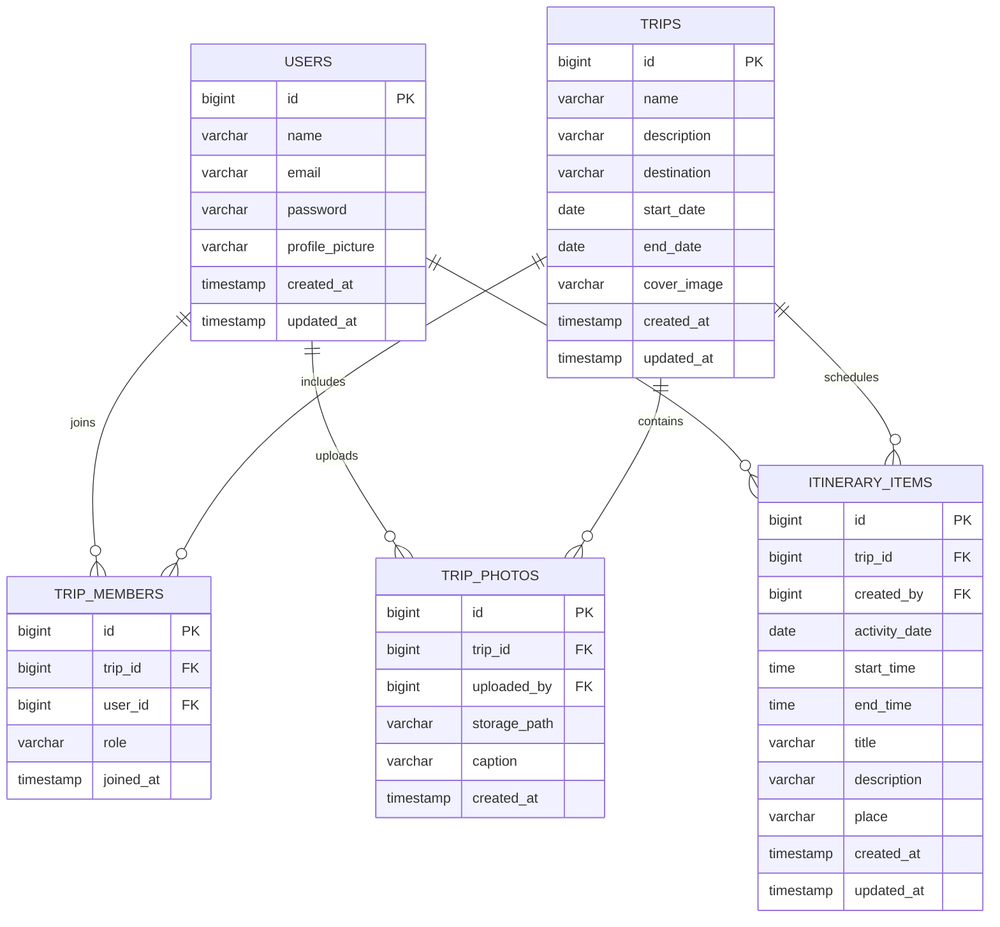

# Database Model

Our Journey uses PostgreSQL through Spring Data JPA. The model separates trip membership from users and trips so that multiple users can collaborate on the same trip with different roles.

## Entity relationship diagram

## Entity responsibilities

### User

Stores account information, the BCrypt password hash and the optional profile-picture URL.

### Trip

Stores the shared trip information and the private storage path of its optional cover image. Trip ownership is not stored directly on this entity; it is represented by an associated `TripMember` with the `OWNER` role.

### TripMember

Links a user to a trip. Its role is either `OWNER` or `MEMBER`. The database enforces a unique constraint on the combination of `trip_id` and `user_id`, preventing the same user from joining one trip more than once.

### TripPhoto

Stores photo metadata, including the private Supabase storage path, optional caption, uploader and creation time. The database stores the path rather than a signed URL because signed URLs are temporary and generated when responses are requested.

### ItineraryItem

Represents one activity in the shared itinerary. Each item belongs to a trip, records its creator and contains its date, time range, title, optional description and optional place.

## Relationship summary

| Parent | Child | Relationship |
|---|---|---|
| `User` | `TripMember` | A user can belong to multiple trips. |
| `Trip` | `TripMember` | A trip can contain multiple participants. |
| `User` | `TripPhoto` | A user can upload multiple photos. |
| `Trip` | `TripPhoto` | A trip can contain multiple photos. |
| `User` | `ItineraryItem` | A user can create multiple itinerary activities. |
| `Trip` | `ItineraryItem` | A trip can contain multiple itinerary activities. |

All primary keys use database-generated `BIGINT` identity values. Foreign-key associations are loaded lazily by JPA.
